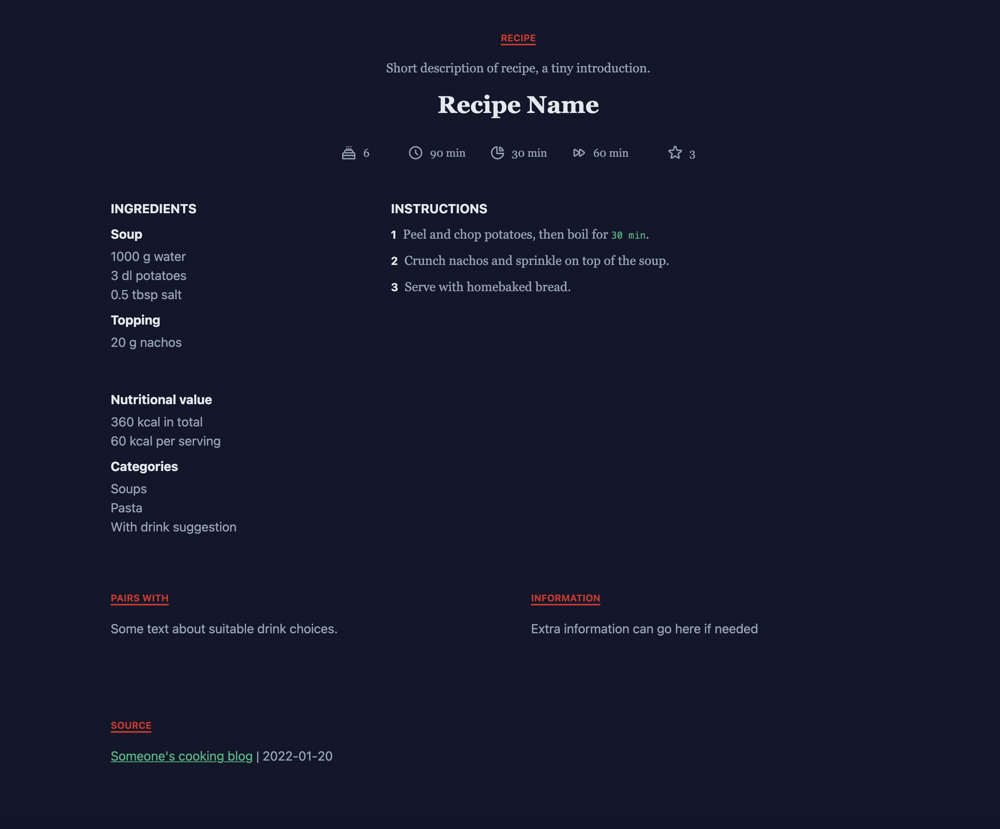
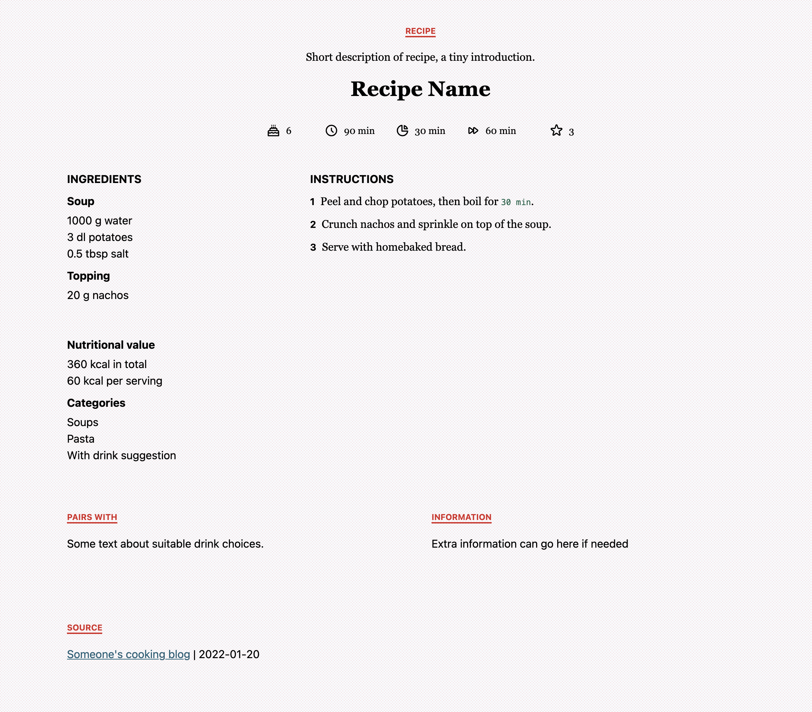

# 🥐 Recipe Manager
Very basic recipe manager, built with Vue 3, Vite and Tailwind (and Vue Router + Vuex).

I wanted to keep the project as light-weight as possible, yet flexible enough to be extended if need be. I also wanted to keep it "database free", so deployment would be a straight-forward procedure.

Recipes are stored as JSON files in `src/data/recipes`.

⚠️ The project's `.gitignore` currently ignores all recipe files that do not contain the name `.example` in the file name.

There's a dark & light theme implemented.





## Feature list
- [x] Clicking on ingredients/steps marks them as done (improve tracking of mise en place/cooking steps)
- [x] Recipes stored in JSON format (no external database)
- [x] Basic internationalization
- [x] Basic recipe metadata (rating, category, cooking time, yield, nutrition)
- [x] [Add print stylesheets](https://github.com/postmodernistx/recipe-manager/issues/22)

### To Do
- [ ] [Add metadata to index.html](https://github.com/postmodernistx/recipe-manager/issues/21)
- [ ] [Route transitions](https://github.com/postmodernistx/recipe-manager/issues/20)
- [ ] [Improve documentation](https://github.com/postmodernistx/recipe-manager/issues/19)
- [ ] [Better front page styling](https://github.com/postmodernistx/recipe-manager/issues/18)
- [ ] [Timer from <time> tag](https://github.com/postmodernistx/recipe-manager/issues/6)
- [ ] [Focus styles/keyboard navigation](https://github.com/postmodernistx/recipe-manager/issues/5)
- [ ] [Scale recipe ingredients](https://github.com/postmodernistx/recipe-manager/issues/4)
- [ ] [Links list to recipe sites (favorites)](https://github.com/postmodernistx/recipe-manager/issues/9)
- [ ] [Nutrition information based on database/ingredients](https://github.com/postmodernistx/recipe-manager/issues/1)
- [ ] [Difficulty property](https://github.com/postmodernistx/recipe-manager/issues/11)
- [ ] [Generate grocery list/meal planner](https://github.com/postmodernistx/recipe-manager/issues/12)
- [ ] [Add recipe UI](https://github.com/postmodernistx/recipe-manager/issues/24)
- [ ] [Search functionality](https://github.com/postmodernistx/recipe-manager/issues/25)

## Deployment
Build the project through the `build` script in `package.json`. The current settings are set to up to run the project from a root directory (like a subdomain), but this can be configured through `vite.config.js` and by setting the [base path](https://vitejs.dev/guide/build.html#public-base-path).

## Translations/i18n
This is also kept really low-level in this project. Language JSON files are stored in the folder `src/locales`.

To create a new language, copy the contents of an existing language file and replace the strings to your liking.

The JSON file is imported in `main.js` as so:
```javascript
// 🌍 Change language here
import locale from './locales/en.json';
```

The language is then registered and made globally available through `app.config.globalProperties.locale = locale;` in `main.js`.

Currently there's 🇺🇸 English, 🇸🇪 Swedish and 🇫🇮 Finnish present.

- [ ] The `<title>` tag needs to be changed manually in `index.html`
- [ ] The `<html lang="">` [attribute](https://en.wikipedia.org/wiki/List_of_ISO_639-1_codes) needs to be changed manually in `index.html`

## Tech notes
### Stack
This project runs on Vue 3 + Vite + Tailwind + Vue Router + Vuex (and Prettier for linting).

### Upgrading Vue
To upgrade project dependencies, run `vue upgrade`.
